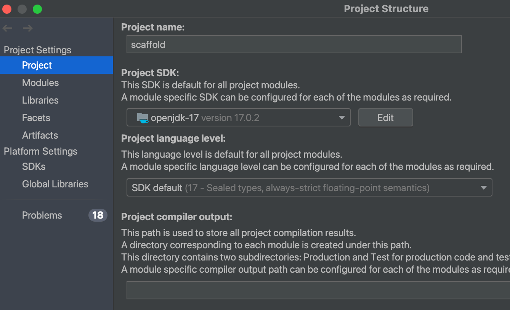

# SpringBootScaffold
`SpringBootScaffold` is a scaffold for Spring Boot project. It contains basic configurations and common used components.
- Spring Boot: `3.1.0`
  - Spring JPA
  - Spring Web
  - Spring Test
  - Thymeleaf
- Spring Doc (Swagger): `2.3.0`
- Lombok: `1.18.30`
- Database Connector:
  - H2 Database: `2.2.224`
  - MySQL Connector: `8.2.0`
  - PostgreSQL: `42.7.1`
- Mapstruct: `1.5.5.Final`


## How to use
1. Make sure your IDEA IDE setting to JDK 17.
   
2. Run `MainApplication.java` to start the server.
3. Open [http://localhost:8080/swagger-ui/index.html](http://localhost:8080/swagger-ui/index.html) to see the swagger doc.
4. The data will save to H2 database file `./springboot_scaffold.mv.db` by default.

## How to change different database
Default **SpringBootScaffold** database is `H2`, you can change to other database easily by specifying environment variables or `application.yml`.

Following shows how to change by environment variables.

### H2
H2 is **DEFAULT database** for **SpringBootScaffold**. Its configuration is:
```dotenv
DB_JDBC_URL=jdbc:h2:file:./springboot_scaffold
DB_USERNAME=sa
DB_PASSWORD=password
DB_DRIVER_CLASS=org.h2.Driver
DB_JPA_DIALECT=org.hibernate.dialect.H2Dialect
```

### MySQL
Create a MySQL database named `springboot_scaffold`, then setup environment variables as following (change accordingly):
```dotenv
DB_JDBC_URL=jdbc:mysql://localhost:3306/springboot_scaffold?useUnicode=true&characterEncoding=utf-8&allowPublicKeyRetrieval=true&useSSL=false&serverTimezone=GMT%2B8
DB_USERNAME=root
DB_PASSWORD=12345678
DB_DRIVER_CLASS=com.mysql.cj.jdbc.Driver
DB_JPA_DIALECT=org.hibernate.dialect.MySQLDialect
```

### PostgreSQL
Create a PostgreSQL database named `springboot_scaffold`, then setup environment variables as following (change accordingly):
```dotenv
DB_JDBC_URL=jdbc:postgresql://localhost:5432/springboot_scaffold
DB_USERNAME=postgres
DB_PASSWORD=12345678
DB_DRIVER_CLASS=org.postgresql.Driver
DB_JPA_DIALECT=org.hibernate.dialect.PostgreSQLDialect
```


## How to Build Jar
```shell
java --version  # make sure your java version is 17
./gradlew clean build
java -jar build/libs/SpringbootScaffold.jar
```


## Quick Deploy

[](https://cloud.digitalocean.com/apps/new?repo=https://github.com/runlala/SpringBootScaffold/tree/main&refcode=026c8249359c)


### Deploy to render.com
### Deploy to Heroku